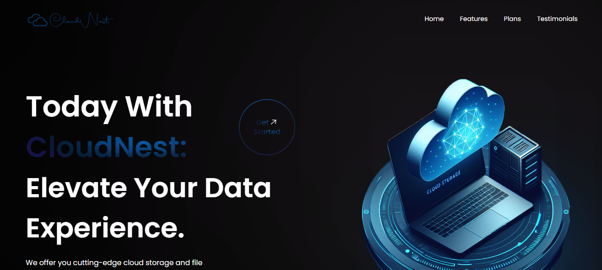
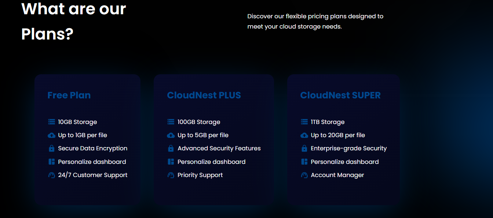
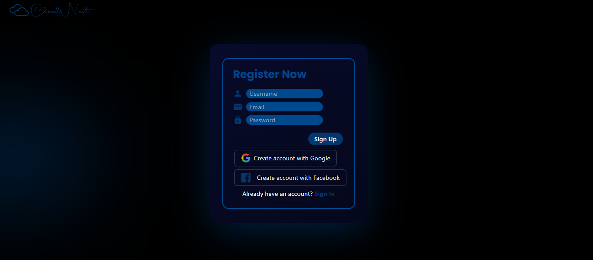
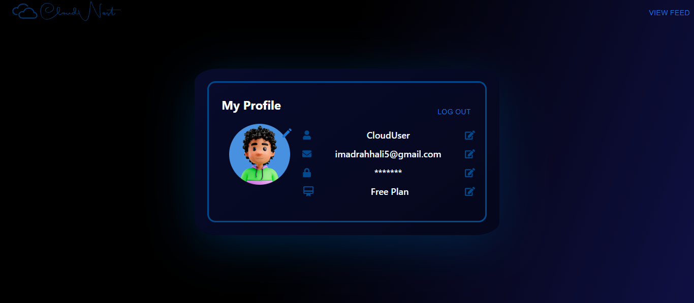
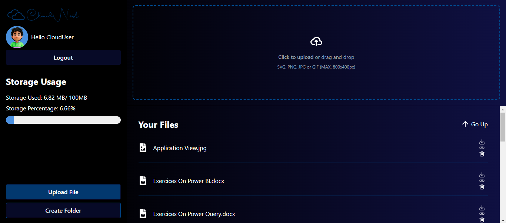
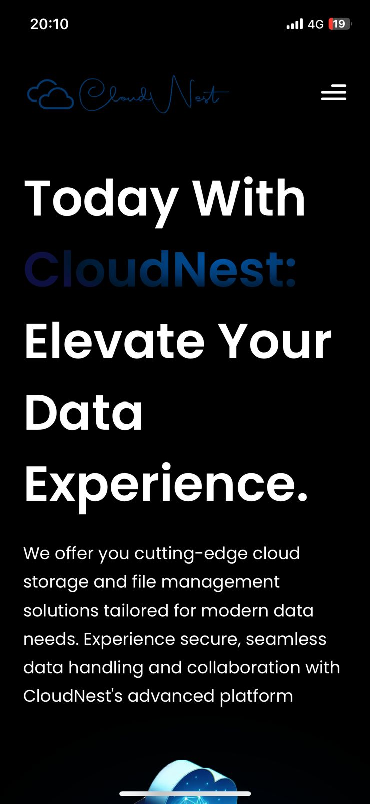
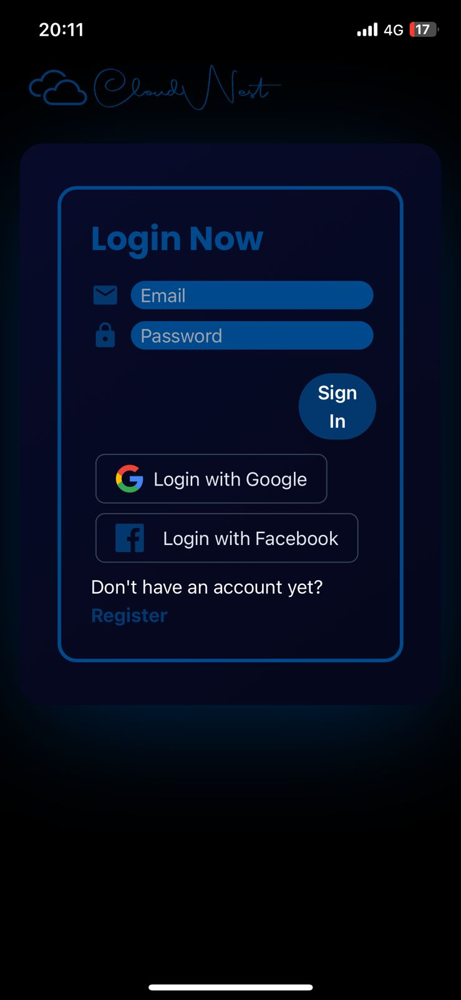

# CloudNest


CloudNest is an innovative application designed for seamless file storage and management, offering users a reliable and efficient solution to handle their digital assets. With its intuitive interface, users can easily navigate through their files, upload new content, and organize everything into neatly structured folders. Whether you need to store documents, images, or any other type of file, CloudNest is built to accommodate your needs, ensuring a smooth and hassle-free experience.





## Features

- **User Authentication:** Sign up and log in using email/password, Facebook, or Google with Firebase Authentication.
- **Profile Management:** Update your profile by adding a profile picture, changing your name, email, or password, and updating your stored data.
- **File Storage:** Upload any type of file and manage them effortlessly.
- **Folder Management:** Create folders to organize your files.
- **File Operations:** View, delete, and manage your stored files.
- **Public Links:** Generate public links for files and folders to share with others.
- **Storage Limit:** Monitor your storage usage based on your plan.




## Technologies Used

- **Frontend:**
  - React.js
  - Tailwind CSS
- **Backend:**
  - Firebase (Authentication, Firestore Database, Firebase Storage)
  


## Deployment

CloudNest uses Firebase Hosting and GitHub Actions for automatic deployment and build. Any changes pushed to the main branch trigger a workflow that builds the project and deploys it to Firebase Hosting.

## Progressive Web App

CloudNest leverages service workers to enable offline capabilities and enhance performance, ensuring that users can access their files even without an active internet connection. As a Progressive Web App (PWA), CloudNest offers a seamless, app-like experience on any device, with the added benefit of being installable directly from the browser. Its responsive design, built with Tailwind CSS, ensures that the application adapts beautifully to various screen sizes, providing a user-friendly experience on both desktop and mobile devices.

 


## Usage

### Clone the Repository

1. Clone the repo:
   ```sh
   git clone https://github.com/yourusername/cloudnest.git
2. Navigate to the project directory:
   ```sh
   cd cloudnest
3. Install dependencies then start the server:
   ```sh
   npm install
   npm start

### Or Use the Hosted Version

Access the Live Application at [CloudNest](https://cloudnest-1.web.app

## Contributing

Contributions are welcome! Please open an issue or submit a pull request for any changes or enhancements.
   
